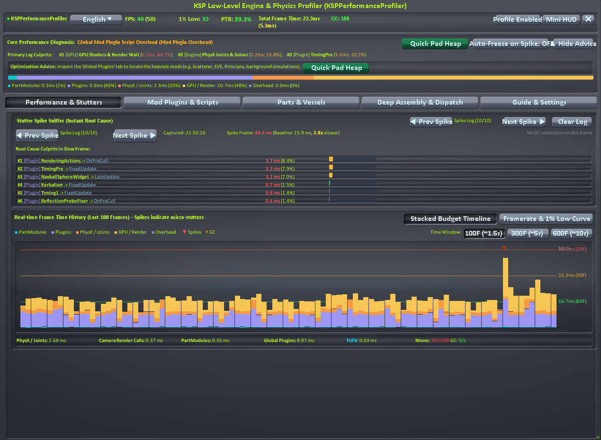
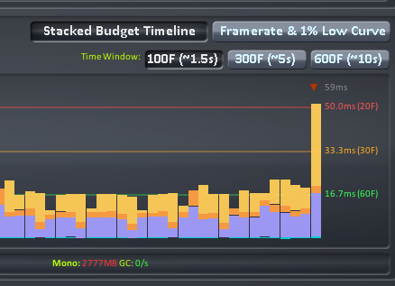
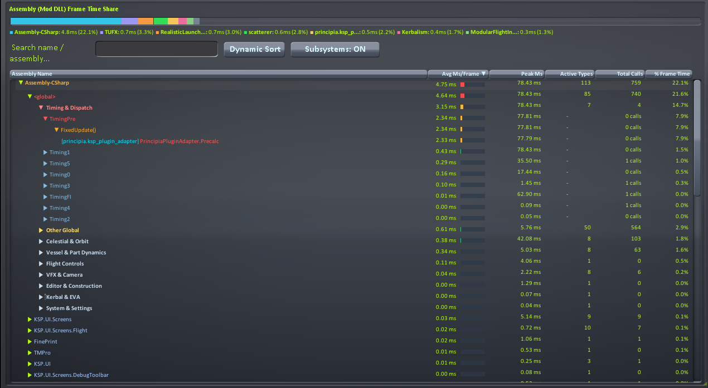
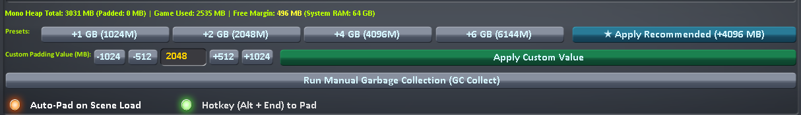

# 🚀 KSPPerformanceProfiler

[](https://www.kerbalspaceprogram.com/)
[](LICENSE)
[](https://github.com/DiaoDaiaChan/KSPPerformanceProfiler/releases)
[](#-language--%E5%A4%9A%E8%AF%AD%E8%A8%80)

> **Next-Generation In-Game Low-Level Performance Profiler, Stutter Hunter & Native Mono Heap Padder for Kerbal Space Program (KSP 1.12.x).**  
> *坎巴拉太空计划新一代低开销游戏内底层性能分析器、微卡顿猎犬与原生 Mono 堆内存防卡顿管理工具。*

---

## 📖 目录 / Table of Contents
- [✨ 为什么选择 KSPPerformanceProfiler? / Why This Mod?](#-为什么选择-kspperformanceprofiler--why-this-mod)
- [🖼️ 界面预览 / Visual Showcase](#️-界面预览--visual-showcase)
- [🌟 核心杀手级特性 / Killer Features](#-核心杀手级特性--killer-features)
  - [1. ⚡ 原生 Mono 堆内存防卡顿管理 (Native Mono Heap Padder)](#1--原生-mono-堆内存防卡顿管理-native-mono-heap-padder)
  - [2. 🎯 掉帧瞬态抓拍与卡顿自动冻结 (Spike Sniffer & Auto-Freeze)](#2--掉帧瞬态抓拍与卡顿自动冻结-spike-sniffer--auto-freeze)
  - [3. 📊 交互式微秒时间线图表 (Interactive Timeline Graph)](#3--交互式微秒时间线图表-interactive-timeline-graph)
  - [4. 🧠 智能瓶颈诊断与处方引擎 (Smart Bottleneck Diagnostics)](#4--智能瓶颈诊断与处方引擎-smart-bottleneck-diagnostics)
  - [5. 🌳 五层深度级联钻取与调度器穿透 (5-Level Deep Drill-Down)](#5--五层深度级联钻取与调度器穿透-5-level-deep-drill-down)
  - [6. 🪟 自由拖拽缩放与自适应布局 (Free Resize & Responsive UI)](#6--自由拖拽缩放与自适应布局-free-resize--responsive-ui)
- [⌨️ 快捷键指南 / Hotkeys Guide](#️-快捷键指南--hotkeys-guide)
- [📦 安装说明 / Installation](#-安装说明--installation)
- [🛠️ 源码构建 / Build from Source](#️-源码构建--build-from-source)
- [❓ 常见问题 / FAQ](#-常见问题--faq)
- [📄 开源协议 / License](#-开源协议--license)

---

## ✨ 为什么选择 KSPPerformanceProfiler? / Why This Mod?

传统的 Mod 性能排查通常极其痛苦：要么盲目二分法卸载 Mod 测试，要么依赖笨重的 Unity Profiler（需要附加外部调试进程），或者安装老旧不兼容的旧时代工具。

**KSPPerformanceProfiler** 彻底革新了这一体验：
- **全程零离开游戏**：在飞行画面内直接呼出，零感知运行时拦截损耗（<0.05ms）。
- **穿透“披着原生外衣”的高耗时 Mod**：传统工具看 `TimingPre` 或 `TimingManager` 只能看到原生代码耗时，而本 Mod 可**直接钻入委托调用链**，瞬间抓出躲在原生调度器背后的真实 Mod（如 Principia、Scatterer、EVE 等）！
- **内置堆内存垫高 (MemGraph Replacement)**：无需额外安装独立的 MemGraph 或 HeapPadder，本工具原生集成常驻堆内存保护，彻底延缓 Mono GC Stop-The-World 卡顿。
- **掉帧自动急冻**：卡顿发生时瞬间抓拍并暂停，从容复盘真凶。

---

## 🖼️ 界面预览 / Visual Showcase

| 监控大盘与交互式图表 (Dashboard & Timeline) | 掉帧瞬态抓拍与真凶分析 (Spike Sniffer) |
|:---:|:---:|
|  |  |
| **调度器委托深度穿透 (Dispatcher Penetration)** | **堆内存垫高与内存推荐 (Heap Padder & RAM Guide)** |
|  |  |

*(若要查看常驻轻量模式，请参考 [迷你 HUD 预览](Screenshots/05_mini_hud.png))*

---

## 🌟 核心杀手级特性 / Killer Features

### 1. ⚡ 原生 Mono 堆内存防卡顿管理 (Native Mono Heap Padder)
- **彻底消除 GC 刺客**：基于静态常驻 GC 根对象（Permanent GC Root）分配物理内存块，即使在游戏内手动或自动触发 GC，**垫高块也绝不释放、绝不回缩**，将 GC 停顿由每几秒一次大幅推迟至数十分钟一次！
- **智能物理内存探测**：自动识别玩家本机物理 RAM 大小（8GB / 16GB / 32GB+），智能推荐最优垫高容量，并计算安全保留线（预留至少 4GB 供 Windows 系统与 GPU 渲染使用）。
- **自由微调手柄**：支持手动键入任意数值（MB），并提供 `[-1024]`、`[-512]`、`[+512]`、`[+1024]` 快速增减手柄与一键推荐按钮。
- **安全即时释放**：可随时点击【释放垫高】按钮，立即将占用的缓冲交还系统。

### 2. 🎯 掉帧瞬态抓拍与卡顿自动冻结 (Spike Sniffer & Auto-Freeze)
- **微秒级掉帧雷达**：当某帧耗时突增超过基准 200% 且大于 35ms（或单帧耗时突破 66.6ms / 低于 15 FPS）时，立即截获现场。
- **六大真凶排行榜**：抓拍时列出该帧消耗占比最高的 6 大实体（精确至具体类名、Mod 程序集、生命周期方法，以及是否由 Mono GC 回收引起）。
- **杀手级自动冻结 (Auto-Freeze on Spike)**：打开发射或物理碰撞出现卡顿瞬间，看板立即自动冻结！无需慌乱截图，从容展开排查，分析完毕后一键解除。

### 3. 📊 交互式微秒时间线图表 (Interactive Timeline Graph)
- **多层宏观堆叠与 FPS 曲线双模式**：
  - **堆叠面积图 (Stacked Area)**：直观展现部件模块、插件脚本、PhysX 物理、GPU 渲染及引擎调度的切片堆积。
  - **FPS / 1% Low 曲线**：实时标定 60 FPS、30 FPS、20 FPS 警示基准线。
- **悬停穿透检视**：鼠标悬停在波形图任意一根柱体上，即可实时显示该帧的微秒构成与各模块占比。
- **单帧锁定复盘**：点击任意异常帧即可锁定高亮，并在下方常驻分析卡片中复盘该帧构成。
- **图层独立显隐**：支持独立切换 Module、Plugin、PhysX、GPU、Overhead 的显示开关。
- **GC 事件标记**：时间线上方以橙色 `◆` 菱形清晰标出发生垃圾回收的特定帧。

### 4. 🧠 智能瓶颈诊断与处方引擎 (Smart Bottleneck Diagnostics)
- **全方位健康诊断**：
  - 🛑 **物理解算过载 (PhysX & Joints Bound)**：零件数超标、AutoStrut 刚化过度、物理实速比 (PTR) 下降导致游戏时钟变黄/红变慢。
  - 🛑 **Mod 插件脚本过载 (Mod Plugin Overhead)**：定位高耗时全局管理器。
  - 🛑 **部件模块脚本过载 (PartModule Script Bound)**：定位载具上高耗时部件模块（Waterfall、FAR 等）。
  - 🛑 **GPU / 画面渲染瓶颈 (GPU / Render Bound)**：显卡满载、分辨率或抗锯齿过高。
  - 🛑 **TUFX 画面后处理负载 (TUFX Post-Processing Bound)**：深度探测 TUFX 激活通道数与 CPU/GPU 构建耗时。
  - 🛑 **微卡顿 / GC 掉帧 (Micro-Stutters & GC Spikes)**：监控 1% Low 帧率与帧抖动 (Jitter)。
  - 🟢 **极度流畅 (Balanced & Smooth)**：物理时钟满速、帧率平稳。
- **处方级优化建议**：直接指出调优方向（如建议减少 AutoStrut、垫高堆内存或调整后处理抗锯齿倍率）。

### 5. 🌳 五层深度级联钻取与调度器穿透 (5-Level Deep Drill-Down)
- **打破黑盒**：
  - 📦 **程序集层级**：查看各 DLL 的平均耗时、峰值耗时、活跃类型数、调用次数及帧占比。
  - 📂 **智能子系统层级**：按功能子系统（⏱️ 时钟调度、🚀 载具动力学、🪐 天体轨道、👨‍🚀 乘员出舱、🛠️ 编辑器、🎮 操纵、🎨 视效、⚙️ 系统设置）归类。
  - 📄 **类型层级 (Class / Component)**：查看每个具体类的总耗时。
  - ⚙️ **方法层级 (Lifecycle Methods)**：展开查看是 `FixedUpdate()`、`Update()`、`LateUpdate()` 还是 `OnRenderImage()` 在耗时。
  - ⚡ **调度器穿透 (Timing Dispatcher Penetration)**：深入透视 `TimingPre`、`Timing1`~`Timing5`、`TimingFI`、`TimingManager` 等原生时间分发器，直观展示挂载在其内部的第三方 Mod 实际回调（如 `[ksp_plugin_adapter] PrincipiaPluginAdapter.Precalc`）。

### 6. 🪟 自由拖拽缩放与自适应布局 (Free Resize & Responsive UI)
- **右下角自由缩放**：采用标准 `◢` 尺寸控制手柄，随心拖动窗口至任意尺寸（自适应 1080p、2K、4K）。
- **坐标记忆与屏幕防丢失保护**：窗口尺寸和坐标自动保存至配置文件，且自动附带屏幕边界吸附夹紧，杜绝窗口被拖出屏幕外无法找回的问题。
- **迷你 HUD (Mini HUD)**：支持常驻屏幕角落的轻量浮窗，仅展示 PTR、FPS、1% Low、关键警示与简易迷你图。
- **一键诊断导出**：一键导出完整诊断数据报告至 `GameData/KSPPerformanceProfiler/Logs/` 供 Mod 开发者或反馈工单排查。

---

## ⌨️ 快捷键指南 / Hotkeys Guide

| 快捷键 | 功能说明 |
|:---|:---|
| `Ctrl + Shift + P` / `Alt + Shift + P` / `Keypad Plus (+)` | 打开 / 关闭完整性能分析面板 (Toggle Full UI) |
| `Ctrl + Shift + H` / `Alt + Shift + H` | 打开 / 切换迷你 HUD 模式 (Toggle Mini HUD) |
| `Alt + End` / `Mod + End` | 一键垫高 Mono 堆内存 (Quick Pad Heap) |

> 💡 **提示**：也可直接点击游戏右侧应用启动器 (AppLauncher) 上的绿色性能图标打开面板。

---

## 📦 安装说明 / Installation

### 依赖项 (Dependencies)
- **Kerbal Space Program 1.12.x** (1.12.0 ~ 1.12.5)
- **Harmony 2.x** (`000_Harmony`，通常 Community Category Kit、ModuleManager、KSPCommunityFixes 等 Mod 均已自带)

### 手动安装 (Manual Installation)
1. 前往 [Releases 页面](https://github.com/DiaoDaiaChan/KSPPerformanceProfiler/releases) 下载最新的 `KSPPerformanceProfiler-vX.X.X.zip`。
2. 解压并将压缩包内的 `GameData/KSPPerformanceProfiler` 文件夹完整拷贝至你的 KSP 根目录下的 `GameData/` 中。
3. 安装完成后的正确路径结构如下：
   ```text
   Kerbal Space Program/
   └── GameData/
       ├── 000_Harmony/
       └── KSPPerformanceProfiler/
           ├── Icons/
           │   └── icon.png
           ├── Localization/
           │   ├── en-us.json
           │   └── zh-cn.json
           ├── Plugins/
           │   ├── KSPPerformanceProfiler.dll
           │   └── KSPPerformanceProfiler.pdb
           └── KSPPerformanceProfiler.version
   ```
4. 启动游戏并加载存档，进入飞行场景即可自动加载使用。

---

## 🛠️ 源码构建 / Build from Source

本项目面向 .NET Framework 4.7.2 / C# 7.3 开发，支持通过 .NET CLI 或 Visual Studio 进行构建。

```bash
# 1. 克隆代码仓库
git clone https://github.com/DiaoDaiaChan/KSPPerformanceProfiler.git
cd KSPPerformanceProfiler

# 2. 执行编译 (Release 配置)
dotnet build KSPPerformanceProfiler.csproj -c Release
```

构建成功后，MSBuild PostBuild 事件会自动将编译生成的 DLL、PDB、本地化文件及版本信息拷贝输出至目标 `GameData/KSPPerformanceProfiler/` 目录。

---

## ❓ 常见问题 / FAQ

#### Q: 这个 Mod 本身会带来多少性能开销？
**A:** 几乎为零。我们在核心拦截和渲染路径上实行了严苛的 **Zero-Allocation（零堆内存分配）** 策略，避免在主循环中产生任何额外的 GC 垃圾；UI 刷新实行了 250ms 阻尼节流合并，整体 CPU 开销通常小于单帧的 0.05ms。

#### Q: 我已经装了 MemGraph 或 HeapPadder，会冲突吗？
**A:** 本 Mod 的 **Mono Heap Padder** 已完整原生替代了 MemGraph / HeapPadder 的核心功能。建议卸载旧版 HeapPadder / MemGraph，避免两个 Mod 同时向系统申请多份多余的垫高内存造成物理 RAM 浪费。

#### Q: 为什么在主菜单看不到图标？
**A:** 为了保持启动与编辑器的纯净，本 Mod 默认注册于 **Flight（飞行场景）**。进入任何飞行场景后，右侧应用启动器图标和快捷键即可随时呼出。

---

## 📄 开源协议 / License

本项目基于 [MIT License](LICENSE) 协议开放源码，你可以自由学习、分发与修改。欢迎提交 PR 与 Issue！
